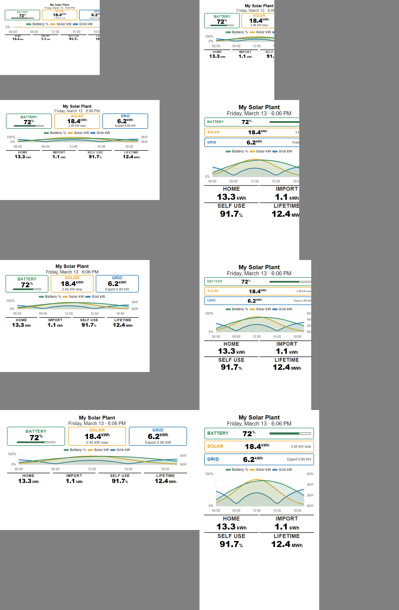

# InkyPi-iSolarCloud

A plugin for [InkyPi](https://github.com/fatihak/InkyPi) that displays real-time solar, battery, and grid metrics from a Sungrow inverter via the iSolarCloud Developer API.

**Status:** Actively maintained

## Screenshot



## Dashboard

The plugin renders a responsive e-ink dashboard showing:

- **Battery** — state of charge (%) with visual bar
- **Solar Today** — daily energy yield (kWh), current generation power (kW)
- **Grid Import** — energy drawn from the grid today (kWh), current import/export power
- **Used Today** — total household consumption today
- **Exported** — energy fed to grid today
- **Self Use** — percentage of load covered by solar
- **All Time** — cumulative energy production

Over the course of a day, a timeseries chart builds up showing battery SOC, solar generation, grid import, and grid export.

The layout adapts to all supported InkyPi display sizes and orientations (400x300 through 800x480, landscape and portrait).

## Installation

Install the plugin using the InkyPi CLI:

```bash
inkypi install isolarcloud https://github.com/jordauld1/InkyPi-iSolarCloud
```

## Setup

### 1. Register a Developer App

1. Log in to the [iSolarCloud Developer Portal](https://developer.isolarcloud.com)
2. Create a new application
3. Note your **App Key** and **Secret Key** from the app details page

The iSolarCloud Developer API is **free** to use. Rate limits are generous and well within the low refresh frequency typical of e-ink displays.

### 2. Find Your Power Station ID (optional)

Your `ps_id` identifies which solar plant to query. **If you leave this blank, the plugin will auto-detect your first power station.**

For accounts with multiple plants, you can find a specific `ps_id` by calling the Developer API `getPowerStationList` endpoint — each plant in the response includes its `ps_id`.

> **Note:** The iSolarCloud web portal (V3) encrypts all URL parameters, so the `ps_id` is not visible in the browser address bar.

### 3. Configure Credentials

Add the following keys to your `.env` file (accessible via the InkyPi **API Keys** page):

```
ISOLARCLOUD_USERNAME=your_isolarcloud_email
ISOLARCLOUD_PASSWORD=your_isolarcloud_password
ISOLARCLOUD_APPKEY=your_developer_app_key
ISOLARCLOUD_SECRET=your_developer_secret_key
```

| Key | Source |
|-----|--------|
| `ISOLARCLOUD_USERNAME` | Your regular iSolarCloud account email |
| `ISOLARCLOUD_PASSWORD` | Your regular iSolarCloud account password |
| `ISOLARCLOUD_APPKEY` | Developer Portal → your app → App Key |
| `ISOLARCLOUD_SECRET` | Developer Portal → your app → Secret Key |

All credentials are transmitted over encrypted HTTPS connections.

### 4. Configure the Plugin

In the InkyPi web interface, select the **iSolarCloud** plugin and set:

- **Region** — choose the gateway your installation was set up on (Global, Europe, Australia, or International)
- **Power Station ID** — your `ps_id` from step 2 (leave blank to auto-detect)

## API Details

This plugin uses the [iSolarCloud Open API V1](https://developer.isolarcloud.com) (plaintext authentication). It fetches plant-level real-time data using the `getDeviceRealTimeData` endpoint.

**Regional gateways:**

| Region | Gateway URL |
|--------|-------------|
| Global | `https://gateway.isolarcloud.com/openapi` |
| Europe | `https://gateway.isolarcloud.eu/openapi` |
| Australia | `https://augateway.isolarcloud.com/openapi` |
| International (HK) | `https://gateway.isolarcloud.com.hk/openapi` |

The plugin authenticates on each refresh and does not persist tokens.

## Compatibility

- **Inverters**: Sungrow inverters registered with iSolarCloud
- **Displays**: All InkyPi-supported e-ink displays (400x300 through 800x480, landscape and portrait)
- **Dependencies**: No additional Python packages beyond what InkyPi already provides

## License

This project is licensed under the MIT License — see the [LICENSE.md](LICENSE.md) file for details.
